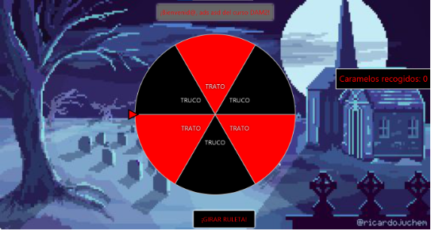
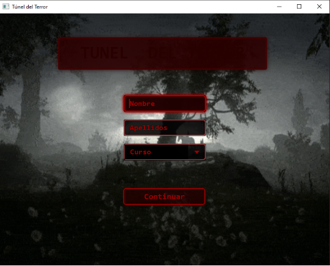

# 🎃 TrucoOTrato

TrucoOTrato es un proyecto desarrollado por Ivannovichh que combina creatividad, lógica y diversión en una experiencia única. Su objetivo principal es ofrecer una base sólida para el desarrollo de aplicaciones interactivas centradas en la gestión, automatización o gamificación de “trucos” y “tratos” entre usuarios o elementos del sistema.

---

## 🧩 Contenido del repositorio

- **Código fuente principal** en `src/`
- **Gestor de dependencias Maven** (`pom.xml`, `mvnw`, `mvnw.cmd`, `.mvn/`)
- **Recursos**: CSS, imágenes, vistas, scripts
- **Pruebas unitarias** para validar la funcionalidad
- **Documentación adicional** (este README)

---

## 🎯 Funcionalidades principales

### Clases principales

- **`Ruleta.java`**  
  Implementa la ruleta del juego para asignar premios o penalizaciones.  
  **Métodos importantes:**  
  - `girarRuleta()`
  - `asignarPremio(int resultado)`
  - `mostrarRuleta()`

- **`CartaProductos.java`**  
  Gestiona productos y colecciones de cartas.  
  **Métodos importantes:**  
  - `agregarProducto(Producto p)`
  - `eliminarProducto(Producto p)`
  - `obtenerProductos()`
  - `mostrarCarta()`

- **`Temp.java`**  
  Simula cartas con diseño estático y botones de interacción.  
  **Métodos importantes:**  
  - `crearCartaSimulada()`
  - `actualizarCarta()`
  - `botonInteraccion()`

- **`Juego.java`**  
  Contiene la lógica principal del juego y la interacción entre jugadores.

- **`Producto.java`**  
  Representa un producto individual en las cartas.

- **`Utils.java`**  
  Métodos auxiliares para cálculos, sorteos y conversiones.

- **`MainApp.java`**  
  Punto de entrada principal del proyecto (JavaFX, consola o Spring Boot).

---

## 📸 Capturas de pantalla

### Ruleta
  
> Captura de la ruleta.

### Carta de productos
  
> Ejemplo de carta con productos y botones interactivos en la UI.

> **Nota:** Sustituye estas imágenes por capturas reales de tu aplicación.

---

## 🧰 Tecnologías utilizadas

| Tecnología           | Propósito                                             |
|----------------------|-------------------------------------------------------|
| Java                 | Lenguaje de programación principal                    |
| Maven                | Gestión del proyecto y dependencias                   |
| CSS                  | Diseño visual de la interfaz                          |
| Git & GitHub         | Control de versiones y colaboración                   |
| JavaFX / Swing / Spring Boot | Interfaz de usuario y backend (según implementación) |

---

## 🚀 Cómo clonar y ejecutar el proyecto

```bash
git clone https://github.com/Ivannovichh/TrucoOTrato.git
cd TrucoOTrato
```

### Compilar dependencias
- Linux/Mac:
```bash
./mvnw clean install
```
- Windows:
```bash
mvnw.cmd clean install
```
---

## 📁 Estructura del proyecto

```
TrucoOTrato/
├── docs/
│   ├── ruleta.png
│   └── carta.png
├── src/main/java/
│   ├── MainApp.java
│   ├── Juego.java
│   ├── Ruleta.java
│   ├── CartaProductos.java
│   ├── Temp.java
│   ├── Producto.java
│   └── Utils.java
├── src/main/resources/  # CSS, imágenes, vistas
├── src/test/java/       # Pruebas unitarias
├── pom.xml
├── mvnw / mvnw.cmd
├── .mvn/
└── .gitignore
```

---

## 🧑‍💻 Cómo contribuir

1. Haz un fork del repositorio.
2. Crea una nueva rama:
```bash
git checkout -b feature/nueva-funcionalidad
```
3. Realiza cambios o mejoras.
4. Envía un Pull Request con descripción clara.

---

## 📜 Licencia

MIT License.

---

## 💬 Autor

Iván Sánchez Juárez  
GitHub: [@Ivannovichh](https://github.com/Ivannovichh)  
Proyecto creado con 💻, 🎃 y ☕
